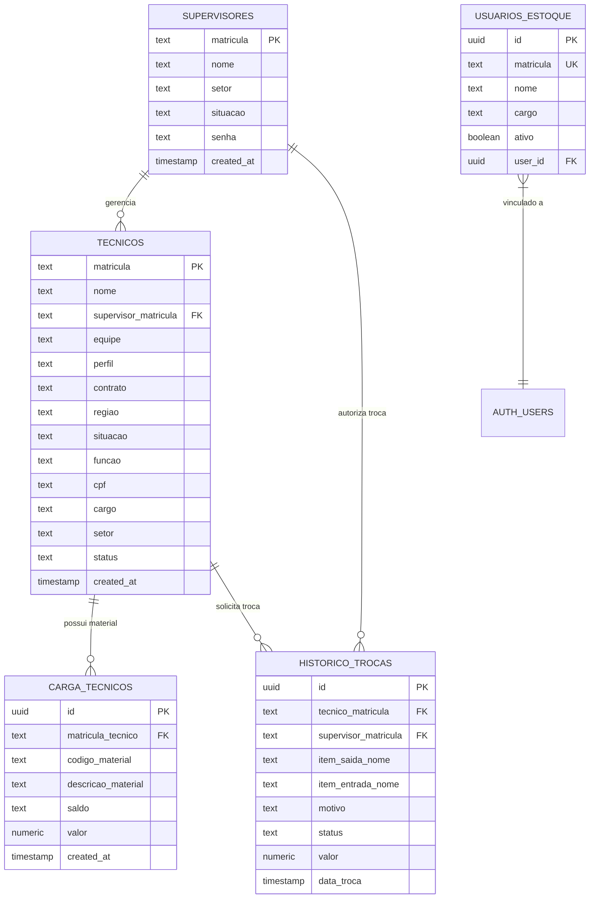

# Documentação do Banco de Dados - Portal Ferramentaria

Este documento fornece uma análise técnica detalhada da estrutura do banco de dados no Supabase, mapeando as entidades, seus relacionamentos e o fluxo de informações do sistema.

## 📊 Visão Geral do Esquema (ERD)

---

## 🛠️ Detalhamento das Tabelas

### 1. `supervisores`
Entidade central de gestão. Armazena os responsáveis por equipes de técnicos.
*   **Chave Primária**: `matricula` (Texto).
*   **Segurança**: RLS Atualmente **Desativado**.
*   **Destaque**: A `matricula` é usada tanto para identificação quanto para `senha` (em alguns fluxos iniciais).

### 2. `tecnicos`
Cadastro principal de colaboradores de campo.
*   **Relacionamento**: Possui uma chave estrangeira `supervisor_matricula` que aponta para `supervisores(matricula)`.
*   **Compatibilidade**: Possui triggers (`trg_tecnico_compat_insert`) que sincronizam campos como `funcao` -> `cargo` e `situacao` -> `status` automaticamente para manter compatibilidade com versões anteriores do app.

### 3. `carga_tecnicos`
Representa o inventário (ferramental/materiais) atualmente em posse de cada técnico.
*   **Volume**: É a tabela com maior carga de dados (~38k linhas).
*   **Cruzamento**: O campo `matricula_tecnico` é a chave de ligação com a tabela `tecnicos`.
*   **Dados**: Armazena tanto a descrição do material quanto o `saldo` e o `valor`.

### 4. `historico_trocas`
Registro de todas as transações de ferramentas entre técnicos e supervisores.
*   **Estados (Status)**: `pedido_em_andamento`, `sem_estoque`, `liberado_retirada`, `retirado`, `cancelado`.
*   **Fluxo de Dados**: Cruza dados de quem solicita (`tecnico_matricula`) e quem autoriza/atende (`supervisor_matricula`). Contém redundâncias propositais (`tecnico_nome`, `supervisor_nome`) para histórico estático.

### 5. `usuarios_estoque`
Gerenciadores do sistema de estoque/ferramentaria.
*   **Integração**: Possui um campo `user_id` vinculado ao `auth.users` do Supabase, permitindo o uso do sistema de autenticação nativo para controle de acesso granular.

---

## 🔄 Cruzamentos Críticos (Joins)

1.  **Dashboard de Supervisão**: 
    `supervisores` -> `tecnicos` -> `carga_tecnicos`.
    *Permite ver o valor total em ferramentas sob a responsabilidade de um supervisor somando o `valor_total` de todos os seus técnicos.*

2.  **Fluxo de Auditoria de Trocas**: 
    `historico_trocas` -> `tecnicos` (via `matricula`) & `carga_tecnicos` (via `codigo_material`).
    *Permite validar se um item solicitado para troca realmente existe no saldo atual do técnico.*

3.  **Controle de Acesso**: 
    `auth.users` -> `usuarios_estoque`.
    *Mapeia o login do Supabase com o perfil de funcionário interno (`cargo`, `matricula`).*

---

## ⚠️ Observações de Manutenção

*   **Row Level Security (RLS)**: As tabelas `supervisores` e `tecnicos` estão com RLS **desabilitado**. Recomenda-se habilitar para proteger dados sensíveis como CPF e senhas.
*   **Tipagem**: Notei que colunas como `data_encerramento` e `saldo` na tabela `tecnicos` estão como `TEXT`. Se houver necessidade de cálculos matemáticos ou filtros de data complexos no Postgres, seria ideal migrar para `NUMERIC` e `DATE/TIMESTAMP`.

> [!TIP]
> Use a view `scripts/database/sql/setup_database_site.sql` como referência para entender como as tabelas de técnicos e supervisores foram populadas a partir de arquivos Excel.
